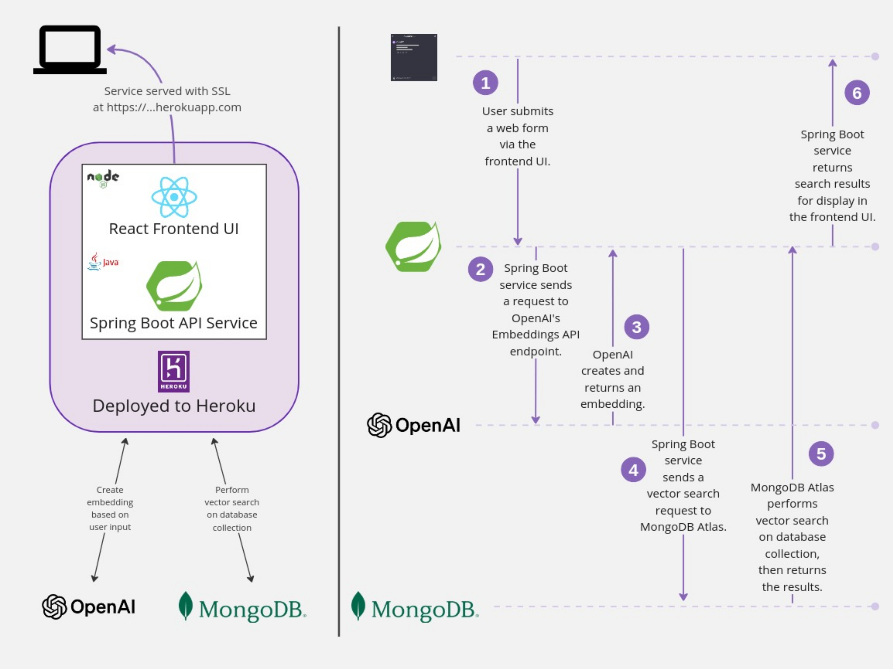

# Moodflicks - MongoDB Atlas for Vector Search with a React UI

[](https://heroku.com/deploy)

This project demonstrates a [Spring Boot](<https://spring.io/projects/spring-boot>) RESTful API that allows consumers to locate a list of appropriate movies based upon a provided mood. The service performs a semantic search on a collection of movies by their plot descriptions, via the use of [MongoDB Atlas](https://www.mongodb.com/cloud/atlas) [Vector Search](https://www.mongodb.com/products/platform/atlas-vector-search) features.



## Requirements

* Java 21 (as of this writing, using 21.0.1)
* Spring 3.2.3 (Maven)
  * May need [this dependency](blob/main/pom.xml?ref_type=heads#L42-47) if you are working on an M1 Mac
* MongoDB Atlas (Cloud) Account to store the sample dataset.
* OpenAI account with [API](https://openai.com/blog/openai-api) access, to generate embeddings on the fly.
* Node.js (as of this writing, using 20.12.1) with npm.

The following steps walk through setup so that you can obtain credentials and connection information for the different services you will be accessing. These will all be environment variables provided to your Spring Boot service at runtime.

## Set up MongoDB

1. Create a MongoDB Atlas account and [log in](https://account.mongodb.com/account/login).
2. Create a new project.
3. Create a new database (M0 tier, which is free) for the project.
    * Check "Add sample dataset", as this is the dataset (`sample_mflix` database with the `embedded_movies` collection) we will use for this demo.
4. Create a database user and copy down that user's username and password. (This will be your `MONGO_USER` and `MONGO_PASSWORD`)
5. You don't need to choose a connection method, but you do need to get the host URL for your cluster. If you choose Shell, you'll see the connection string for your cluster (something like `cluster0.abcdef.mongodb.net`). Copy down this host. (This will be your `MONGO_HOST`)
6. Under Network Access, make sure you have included your current IP address for access to your cluster or allow all access with `0.0.0.0/0`. When deploying to Heroku make sure you add the IP ranges of the region you are deploying to.
7. Go to Organization settings, and click Projects. Find your project, click the meatballs menu (...), and copy the project ID. (This will be your `MONGO_APP_NAME`)
8. Create an Atlas Vector Search (_not_ Atlas Search) index. The index name should be `PlotVectorSearch`, and it should index the `embedded_movies` collection. Use the following JSON configuration for the index (as per the [MongoDB Documentation](https://www.mongodb.com/docs/atlas/atlas-vector-search/create-index/#create-an-example-index-from-the-atlas-ui)):

``` json
{
  "fields": [
    {
      "numDimensions": 1536,
      "path": "plot_embedding",
      "similarity": "euclidean",
      "type": "vector"
    }
  ]
}
```

## Set up OpenAI

1. Create an OpenAI account with API access.
2. Create an [API key](https://platform.openai.com/api-keys). Copy it down. (This will be your `OPENAI_KEY`)

## Build the React client

In the `client` folder, run the following commands to install dependencies and build the static files for the React UI:

``` sh
npm install && npm run build
```

## Build and run the Java application

### Using maven

``` sh
mvn spring-boot:run
```

### Using IntelliJ IDEA

1. Open the project with the root folder pointing to this repo's root folder.
2. In Project Structure, SDKs, add (if you don't have it) a Java v21 SDK.
3. Modify the Run/Debug Configurations to add environment variables. Click "Modify Options" and select "Environment Variables". These variables need to be in the form `KEY=VALUE`, separated by a semi-colon. 
    * `MONGO_USER`: The username you created for MongoDB database access.
    * `MONGO_PASSWORD`: The password you created for MongoDB database access.
    * `MONGO_HOST`: The host for your cluster.
    * `MONGO_DB`: `sample_mflix`
    * `MONGO_APP_NAME`: The project ID for this MongoDB project.
    * `OPENAI_KEY`: The API key you created for OpenAI API access.
    * `OPENAI_URL`: `https://api.openai.com`

    Your environment variables string will look something like this:

    ``` txt
    MONGO_USER=vectordemo;MONGO_PASSWORD=Thisismysecurepassword;MONGO_HOST=cluster0.1234abc.mongodb.net;MONGO_DB=sample_mflix;MONGO_APP_NAME=abcdef123456;OPENAI_KEY=sk-abcdefghijklmnopqrstuvwxyz0123456789;OPENAI_URL=https://api.openai.com
    ```

4. Build the project.
5. Run the `MovieServiceApplication`.

## Test locally

1. Open your browser to [http://localhost:8585/](http://localhost:8585).
2. Test by clicking the **Find Movies** button.
3. Test with curl

```shell
curl -X 'GET' \
  'http://localhost:8585/movies?mood=american+romance' \
  -H 'accept: application/json'
```

For the `american romance` mood, the service should return a `200 OK` response and a list of movies which are the best match for the provided mood.  

Here's a single example movie for brevity:

```json
[
  {
    "title": "Slow West",
    "year": 2015,
    "runtime": 84,
    "released": "2015-04-16T00:00:00.000+00:00",
    "poster": "https://m.media-amazon.com/images/M/MV5BNTYxNDA5ODk5NF5BMl5BanBnXkFtZTgwNzMwMzIwNTE@._V1_SY1000_SX677_AL_.jpg",
    "plot": "A young Scottish man travels across America in pursuit of the woman he loves, attracting the attention of an outlaw who is willing to serve as a guide.",
    "fullplot": "'Slow West' follows a 16-year-old boy on a journey across 19th Century frontier America in search of the woman he loves, while accompanied by mysterious traveler Silas.",
    "lastupdated": "2015-08-28 00:08:15.283000000",
    "type": "movie",
    "directors": [
      "John Maclean"
    ],
    "imdb": {
      "rating": 7.0,
      "votes": 11997,
      "id": 0
    },
    "cast": [
      "Kodi Smit-McPhee",
      "Michael Fassbender",
      "Ben Mendelsohn",
      "Aorere Paki"
    ],
    "countries": [
      "UK",
      "New Zealand"
    ],
    "genres": [
      "Action",
      "Thriller",
      "Western"
    ],
    "tomatoes": null,
    "num_mflix_comments": 0,
    "plot_embeddings": null,
    "id": {
      "timestamp": 1463423976,
      "date": "2016-05-16T18:39:36.000+00:00"
    }
  }
]
```

### Troubleshooting

If you encounter issues, it's likely due to misconfigured environment variables. The network inspector for your browser's developer tools may show where calls to your underlying Spring Boot API failed. This may have to do with incorrect credentials or information for connecting to MongoDB. It's possible that the console in IntelliJ will give you helpful information too, especially if your problem has to do with incorrect OpenAI API credentials or connection information.

## OpenAPI Specification

You can find the the Swagger docs (OpenAPI) for the Spring Boot service by visiting [http://localhost:8585/swagger-ui/index.html](http://localhost:8585/swagger-ui/index.html) when the service is running.

## Manual Deployment

1. Setup all the configuration variables with `heroku config:set`

    ``` sh
    heroku config:set MONGO_USER=...
    ```

2. To manually deploy to Heroku you can run:

    ```sh
    git push heroku main
    ```